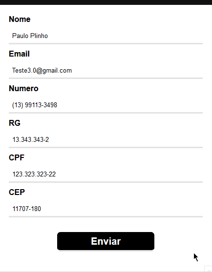
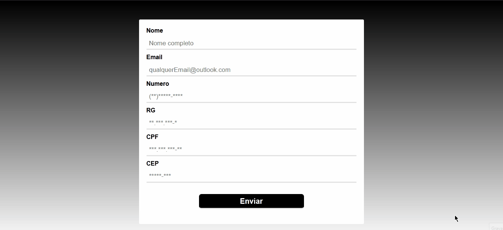

<h1 aling="center">Formulário de validação com JavaScript puro :heart:</h1>
<h2 >Tecnologias<h2> 
 <ul>
  <li>Html5</li>
  <li>Css3</li>
  <li>JavaScript</li>
 </ul>
 

 

 
<h2 >Sobre<h2>

Separei o código com (module nativo no ES6+) então cada input(exemplo: validação do input de nome, tem seu código separado dos demais). Eles estão localizados em Js
/Components
. A declarção
 de todos eles é em Js
/Form.js.

  

